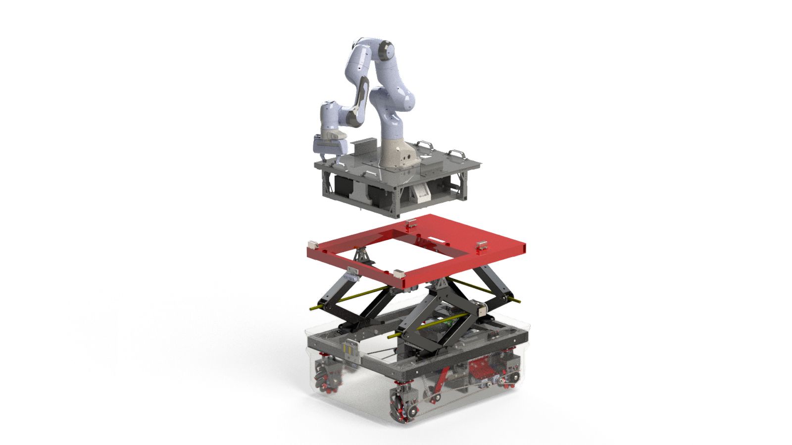
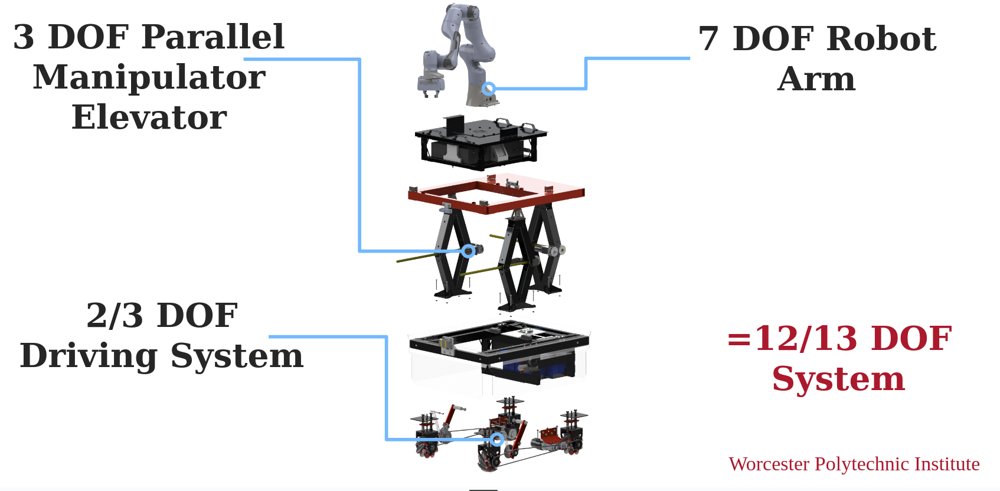
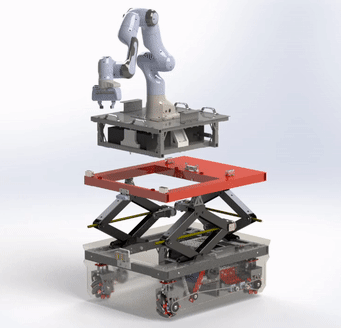
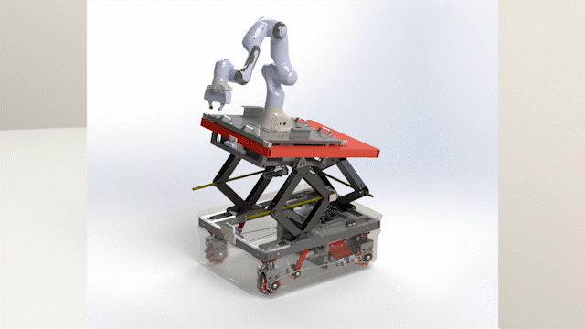
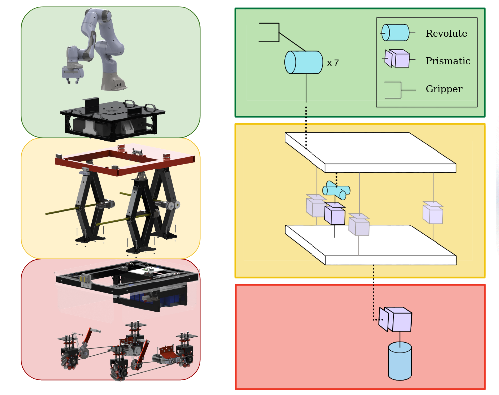
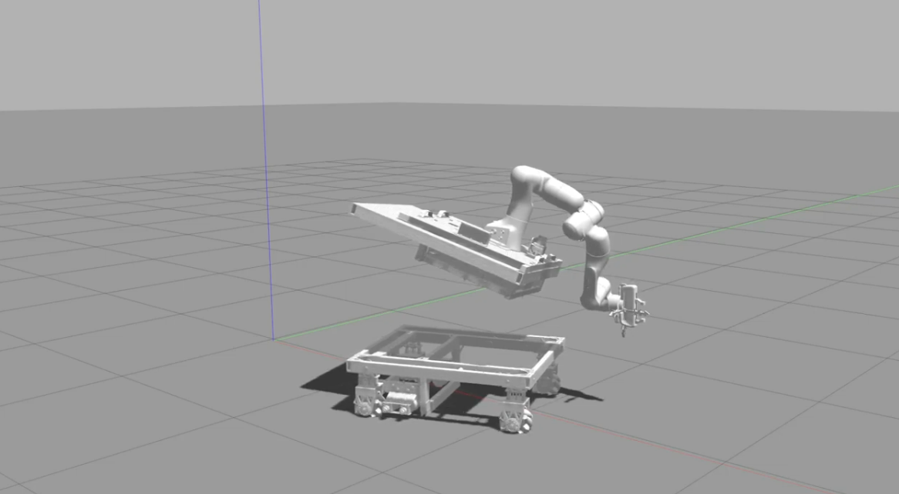

# Mobile Manipulator

Respository for the ROS Gazebo simulation of a Mobile Manipulator. This project is an extension of the [Mobile and Modular Robotic base](https://github.com/RoboticMobileBaseMQP/mobile-base), a project developed for the completion of the WPI Major Qualifying Project requirement. Last Updated: July 2023.

<!--  -->



## What is a Mobile Manipulator?

A Mobile Manipulator can be defined as a robot arm (a manipulator) attached to a mobile base. These systems are usually extremely redudent by having many Degrees of Freedom (DOFs). Our system has 12/13 DOFs depending on the desired configuration. 



A Mobile Manipulator is a highly valuable asset to researchers and manufacturers. A traditional robot arm is constrained to a workspace limited by joint limits, link lengths, and self collision. A Mobile Manipulator allows this workspace to travel which enables significantly more possibilties such as long distance pick and place, rescue operations, bomb defusing, etc. 


## Our Robot's Capabilities

The initial purpose of our Mobile Manipulator was to create a mobile base that can be modular with any robot arm.

### Modularity


The Modular Insert (MI) snaps securely into the mobile base, houses the manipulator controller box (if it has one), and connects to a Universal Plug that communicates with the RPi. We created a charging station that can hold the MI above ground to let the base drive underneath and 'hot-swap' between MI's if desired. The MI also has handles to let two people manually lift the MI out of the mobile base.


### Mobility

Mobility can be broken into two components: chassis/drivetrain and the elevator. The mobile base is a holonomic drive system through independently actuated mecanum wheels. The elevator is a parallel manipulator that can be simplified as three prismatic joints. However, due to internal slack tolerances to the scissor jacks there is a significant amount of 'wiggle room' that lets the MI pivot. 

 




## Holistic Control

With a Mobile Manipulator system it became imperative to find a method to control the system to achieve basic goals such as pick and place. We simulate the mobile robot to ensure the controller will not produce motion that could damage the robot arms in the real world. 

This simulation is based heavily off [Holistic Mobile Manipulation](https://jhavl.github.io/holistic/), developed by Jesse Haviland, Niko Sünderhauf, and Peter Corke. We extend their research through additional redudency in a 3 degree of freedom (DOF) parallel manipulator elevator. We simplify the elevator as a serial linkage consisting of a prismatic joint and two revolute joints. 

<!--  -->



## Holistic Control Demo's
Demo'd below is the execution of the steps in `Bootup / Initialization > Simulation`

Click to play!
<!--  -->
[](https://youtu.be/WngMKqCbG34)


## Installation

There are two types of installation necessary to communicate with the mobile base. If only working with simulation, then only the Host Computer installation needs to be followed. However, if working with the real Mobile Base, the Raspberry Pi installation will also need to be followed.

### Host Computer Installation 

This project was developed using ROS as the framework of choice. Download and install ROS Noetic from [here](http://wiki.ros.org/noetic/Installation). Create a workspace using the following commands: 

```
mkdir MM_ws/src
cd MM_ws
catkin_make_isolated
```

Remove the generated CMakeLists.txt with

```
cd src
sudo rm CMakeLists.txt
```


Next, clone this repo using 

```
git clone https://github.com/ejackson1/Mobile-Manipulator.git
```

Next install the repository for the kortex arm:

```
cd kortex_arm
git clone https://github.com/Kinovarobotics/ros_kortex.git -b noetic-devel
```

`ros_kortex` requires additional steps to build the drivers for the gen3 - follow them [here](https://github.com/Kinovarobotics/ros_kortex).

Our simulation also requires a little tweak to the gen3 URDF. Comment out lines 25-32 and 64-68 in `kortex_arm/ros_kortex/kortex_description/robots/kortex_robot.xacro` to unfix the robot from the world link in Gazebo.

Then install missing dependencies with 

```
cd ../..
rosdep install --from-paths src --ignore-src -r -y
```

Finally, set up your network for ROS. Add the following lines to ~/.bashrc:

```
export ROS_MASTER_URI=http://localhost:11311/
export ROS_HOSTNAME=`hostname -I | cut -f1 -d' '`
```

Then add `raspberrypi <rpi ip address>` to /etc/hosts.

### Raspberry Pi Installation

The Raspberry Pi requires a lot of setup for this project. First, install a 64bit debian “Buster” OS. We recommend downloading the image from [here](https://downloads.raspberrypi.org/raspios_arm64/images/raspios_arm64-2021-05-28/) and using the Raspberry Pi Imager to install it. RaspiOS should now boot up when turning on the Pi.

To control the Franka Emika Panda, a fully preemptible real-time OS is required. Follow the instructions listed [here](https://www.instructables.com/64bit-RT-Kernel-Compilation-for-Raspberry-Pi-4B-/). Note that you will need to use a different kernel version (we used rpi-5.10) and also a different patch version (we used 5.10.104) - pick the version closest to what’s already installed on the Pi. Make sure to follow instructions for `menuconfig` - additional details for enabling the real time preemption model can be found [here](https://unix.stackexchange.com/questions/582075/trouble-selecting-fully-preemptible-kernel-real-time-when-configuring-compil). 

Once the OS is patched, ROS needs to be built. Follow [these instructions](https://varhowto.com/install-ros-noetic-raspberry-pi-4/) for installing ROS Noetic on the Raspberry Pi. 

With ROS installed, the repositories can be installed. Follow the instructions for installing this repository and the kortex_arm repository above. There are 2 additional notes when building kortex_arm:

1. Build the kortex API with a CONAN_TARGET_PLATFORM of artik710. This makes it build properly

2. Delete any packages in kortex_arm that require Gazebo. Gazebo cannot be installed on a Raspberry Pi, and you won’t be running simulations on it, so the packages are unnecessary. 

Lastly, set up the ROS network. Add the following lines to ~/.bashrc:
```
export ROS_MASTER_URI=<host computer IP>:11311/
export ROS_HOSTNAME=`hostname -I | cut -f1 -d' '`
```

One final note: the `franka_description` repository only includes the URDF information for the simulation, as we didn’t have enough time to implement it on the Pi. To actually control the Panda arm, you’ll need to clone the full repository from [here](https://github.com/frankaemika/franka_ros) and monkey it with it on the Pi. Good luck!


## Bootup / Initialization
### Physical Robot
In the back of the mobile base there is a power switch to turn the robot on. Due an accident damaging the batteries, the robot should only be powered on with the charger in place. Reference New Batteries in `Future Recomendations, Improvements, Bug Fixes` for more information.

The procedure for a safe bootup is as follows:
1. Physically check the robot for any problems such as unplugged wires, bolts untightened, or chains not fully tightened. 
2. If the robot arm is attached, ensure that it is fully bolted to the MI, and that the MI is securely attached to the mobile base. 
3. Plug in and turn on the charging system. 
4. Connect the robo charging pads to the robot to the front of the robot. It is a magnetic connection. ENSURE THE PADS ARE IN THE CORRECT ORIENTATION AS A MISCONFIGURATION WILL BLOW UP THE BMS AND DAMAGE BATTERIES.
5. Turn on the robot by flipping the power switch located behind the robot. 
6. Keep the robot charging for atleast 1 minute after bootup. After 1 minute, it is okay to remove the robo pads. It is also fine to keep them attached, but they may come loose if the robot is driving. There is 480W of charging power so be sure not to short it out on the robots chassis if it comes loose!
7. Follow the RPI setup guide to connect to the base with an xbox controller or host computer. 
8. If the Panda arm is connected, ensure all connections (ethernet and power) are connected to the MI. Further, most robotic arm controllers have a power switch- ensure this is turned on, too. 
9. If the CIM motor controllers LEDs blink and send unwanted commands to the motors, turn off the mobile base. This is an ongoing bug that does not have a perminent fix. We utilized chokes on our PWM wires to minimize electrical noise and this reduced the problem but it still sometimes occurs.
10. To turn the robot off, press the red button on the power switch. This will cut the power off to the system. 

The BMS can be connected to a computer with a USB connection. The BMS can provide a wealth of information such as battery health, current draw, and individual cell capacity remaining. To install, please follow [this](https://www.roboteq.com/all-products/battery-management-systems) link.
### Simulation

To run the simulation for the first time we must initalize our workspace.
```
$ cd MM_ws
$ catkin_make_isolated
$ source devel_isolated/setup.bash
```
After initalization, we can spawn the robot in Gazebo with the necessary backend nodes and run the controller.
```
$ roslaunch mobile_base_simulation simulated_arm_and_base.launch arm:=panda
$ rosrun mobile_base_control holistic_control.py
```
Ensure that the `holistic_control` node is only run once Gazebo has finished initalizing. This can usually take about 10 seconds to 2 minutes depending on your hardware. Once run, the mobile manipulator will attempt to travel to a goal Pose. This controller will minimize the distance from the goal Pose to the Pose of the `panda_hand` linkage. 

Optionally, a listener node can be instantiated to record data output from the `holistic_control.py` node with 
```
$ rosrun mobile_base_control holistic_listener.py
```
A velocity controller for just the Panda arm was also created. Currently, when run it will move the arm into a highly manipulable position using a P controller. I utilized this node when `$ roslaunch mobile_base_simulation simulated_arm_and_base.launch arm:=panda` gave a bogus initial position despite the XML condition specified. It can be run with
```
$ rosrun mobile_base_control velocity_control.py
```


## Future Recomendations, Improvements, Bug Fixes

I divided some TODO's into Hardware and Software for clarity. These are in no particular order and for some problems we have already identified a viable solution. Certainly, it is not the only solution but it our recomendation. This project is vast, complex, and unforgiving to mistakes. We believe it would be extremely beneficial to implement atleast some of these ideas to have a more robust system.

### Hardware
1. Redesign and Implement New Drive Train.
    * The current implementation is an outdated mecanum wheel assembly driven through chain and sprocket. The tensioner will tighten the chain so it may firmly drive the sprocket without slack, but it also forces the suspension into compression.  We found that to have suitable tension on the drivetrain, the suspension would be 90-100% fully compressed. By having the suspension fully compressed, the wheels will be challenged to extend when over holes or obstacles. Our initial goal was to implement a suspension system to allow all wheels to simultaneously make contact with the floor. It is critical all mecanum wheels make contact with the floor to allow the driving dynamics to function as intended. Further, we found that the suspension system was too weak to handle the shear forces generated from the holonomic capabilities of mecanum wheels. While ‘strafing’ (perpendicular motion relative to the front of the base), the suspension system would cave inwards. When reducing the system to a 2DOF spin in place/drive system, the load was significantly less. 
    * **Solution**: We recommend a complete redesign of the suspension, tensioner, and drive train. Holonomic capabilities are the highest priority as this allows the base to be extremely maneuverable. We suggest continuing to use mecanum wheels with an updated design or to implement swerve drive. An updated mecanum wheel setup should be less costly than a swerve setup. However, we recommend purchasing new mecanum wheels (the current ones are ~10 years old), a new tensioner, and a suspension redesign. Our design opted to be the most budget friendly and it sacrificed usability. 
2. Elevator Joint Redesign
    * The scissor jacks used as a parallel manipulator are bolted directly to the Modular Insert and base. This means that pivoting is only possible due to the tolerances inside of the scissor jacks themselves. Ideally, the connection points should be ball joints for less constricted motion. A [6DOF Stewart Platform](https://en.wikipedia.org/wiki/Stewart_platform) illustrates what a balljoint, prismatic joint, balljoint connection should look like. When we initially designed and built the elevator system, pivoting was not intended. It was only after how useful it appeared to be did we consider it a design feature. In simulation, we make use of the flexibility provided by the scissor jacks.
3. Raspberry Pi 4b Upgrade
    * The Raspberry Pi4b struggled to compile the drivers necessary to operate the Kinova Gen4 and Panda Franka Emika arm due to small amounts of RAM (it actually couldn’t compile on the 2GB module). Further, the Pi is not powerful enough to handle high end sensor data, such as a LiDAR. The Pi is also not shielded adequately and a 3D printed shield should be designed and implemented.
    * **Solution**: A Nvidea Xavier was purchased to replace the Pi and become the main board on the base. Contact Jessica De Oliveira to receive the board as the sent model was not correct and it needs to be returned. 
4. SICK LiDAR Addition
    * A SICK LiDAR is available to be added to the Modular Insert. This is a 2D LiDAR that (hopefully) can be implemented with an understanding of the elevator's nature to build a 3D model of its surroundings. In simulation, we feed the goal as a static Pose in world space but in the real world this Pose can be determined by the SICK LiDAR. The LiDAR needs to be mounted, as well. Reference the CAD for the designated location.
5. LED Implementation
    * We put LEDS on the bottom of the base to be used as debugging for the real base. However, this was a low priority item that never ended up being implemented. The LEDs are connected to the Pi and can be controlled with simple SPI communications. The LEDs are knockoff [Adafruit NeoPixels](https://www.adafruit.com/product/1461) and function exactly the same.
6. New Batteries
    * The current batteries were damaged by accidentally shorting the electrical system by inverting the charging system. As a result, the Battery Management System (BMS) exploded and the batteries were damaged. With the damaged batteries, the robot is susceptible to not turn on. We monitored the batteries and found that during bootup they will flicker between 7V and 24V and eventually stabilize to their rated voltage or drop to 0V. **This behavior is extremely concerning and new batteries should be purchased at some point.** We found that if the charger was connected to the robot during initialization that it would always successfully bootup. After one minute of bootup, the charger may be removed if desired. 
7. Attach SRX Mag Encoder to the Drive Train
    * SRX Mag Encoders were purchased to easily attach to the CIM motors to track the position of the robot. These encoders were not physically added. Contact Jessica De Oliveira to have these encoders given to the new team. Please reference the quote 11990756 in the Google Drive.

### Software

1. Real Life Hardware 
    * Upgrade/translate Pi ROS nodes into Nvidea Xavier nodes
    * Implement ROS node to handle new encoder data from SRX Mag Encoder
    * Implement ROS node to process SICK LiDAR data utilizing processing power of Nvidea Xavier
        * Incorporate SICK LiDAR 2D data into a 3D model representation by changing it's configuration with the elevator. For example, imagine a 2D scan moving down a wall, if you stack the data you can visualize the wall!
    * Implement `holistic_control.py` node onto the Nvidea Xavier after tweaking it to fit the real robot and not the simulation.
    * Charging station recognition and charging alignment.
2. Simulation
    * OOP upgrades, especially in the control section (`mobile-base/mobile_base_control`). There are many areas that can benefit from better code practices to improve readability and clarity.
    * Adding SICK LiDAR to sensor to the simulation.
        * This allows for object recognition nodes and [SLAM](https://en.wikipedia.org/wiki/Simultaneous_localization_and_mapping)
    * Accurate model of parallel elevator structure instead of serial linkage simplification
    * Stop robot from spawning in ground ~5cm. A cheap fix is to simply spawn the MI 5cm taller.
    * The collision box of the MI is slightly innacurate and misplaced. A simple translational adjustment should be sufficient.
    * Add collision obstacle avoidance into the Quadratic Program as in [NEO](https://arxiv.org/abs/2010.08686)
    * Implement other metrics besides Yoshikawa Manipulability to be maximized.
        * Maximizing the [Power Manipulability](https://doi.org/10.1016/j.rcim.2010.09.004) seemed fruitful but it was too complicated to implement / recreate the results from the original paper.
        * Minimizing the [Inertia Ellipsoid](https://doi.org/10.1109/ROBOT.1984.1087211) was another idea considered for implementation. 
        * A homogenous Jacobian metric would solve the prismatic and revolute joint unit mismatch (the elevator is a prismatic joint and two revolute joints, while the arm is seven revolute joints), which would enable a maximization of the entire Elevator system AND the arm.
    * Spawn a world with objects that are graspable. Additionally, this would could contain obstacles that need to be avoided. 
        * In a late stage, multiple Mobile Manipulators could be programmed to work in collaboration!
    * Adding in the charging station to the environment. Give the video/LiDAR sensor(s) something to align with such as a QR code or unique shape. Then, the robot should know the charger is below and simply drive forward to interface with the magnetic robo pads.
    * Redesign the Forward Kinematics of the Mecanum wheel logic to use effort controllers instead of world velocity controllers with prismatic joints. As of this implementation, if the Quadratic Program outputs 2.0 meters/second forward then an individual wheel velocity is calculated, thrown into the kinematics of mecanum wheels with respect to the chassis dimensionality/positioning, and returned with a correlating world velocity. This world velocity is instantly achieved which is unrealistic. 

## Helpful Links
Below are some links to where you can locate information from previous meetings, relevant repositories, and the CAD repo for the Mobile Manipulator. Please email ejackson@wpi.edu if you are having difficulty gaining access. 
1. Google Drive: https://drive.google.com/drive/folders/1HUbkGtqpoOaKrL5r19ZUg35KUtvNREoB?usp=sharing
    * Meeting Notes & Capstone Presentation 
    * Financial Information
    * Manipulability Papers & Idea Exploration
2. Panda Robot: https://github.com/frankaemika/franka_ros
3. Kortex Gen3: https://github.com/Kinovarobotics/ros_kortex
4. SICK LiDAR: https://github.com/SICKAG/sick_scan_xd
5. MQP Repo: https://github.com/RoboticMobileBaseMQP/mobile-base
6. MQP Paper: 
7. MEGA CAD Repo: https://mega.nz/folder/Nd42hBbZ#FcceDbHR-tFMgTfWMoZtRg
8. Zotero Library: https://www.zotero.org/groups/4923979/mobile_manipulation/library

## Usage

This simulation is still in development. The following is a description of some of the launch files included in this repository.


### simulated_arm_and_base.launch
`roslaunch mobile_base_simulation simulated_arm_and_base.launch arm:=xyz`

Simulates the mobile robot in Gazebo. Use `arm:=` to specify which arm should be loaded. Available arms are `panda` and `gen3`. Note, significant changes have been made and `gen3` is no longer tested / developed.

### holistic_control.py
`rosrun mobile_base_control holistic_control.py`

Spawns controller node to move Mobile Manipulator to manuever to desired Pose

### holistic_listener.py
`rosrun mobile_base_control holistic_listener.py`

Spawns listener nodes to plot Mobile Manipulator metrics over the duration of motion. Listening metrics include Yoshikawa Manipulability, Jerk, or positional data.

### velocity_control.py
`rosrun mobile_base_control velocity_control.py`

Spawns a proportional velocity controller to orientate the arm into a highly manipulatible pose. This can also be used to command the arm into the same starting position reliably. This file can be easily edited to adjust the configuration the arm converges to. 

### base_sim_alone.launch
`roslaunch mobile_base_simulation base_sim_alone.launch`

Simulates only the mobile base. Helpful for debugging teleop modes.

### base_teleop.launch
`roslaunch base_package base_teleop.launch`

Launches the nodes necessary to connect to the mobile base through the Raspberry Pi. Control the mobile base with an xbox 360 controller. 

### remote_nodes.launch
`roslaunch base_package remote_nodes.launch`

Launch this file on the Raspberry Pi for controlling the mobile base and interfacing with the robot arms.

### host_moveit.launch
`roslaunch kortex_insert_description host_moveit.launch`

Launches MoveIt! on the host computer. Used to interface with robot arms when connected to the Pi. Note, MoveIt functionality in Panda simulation has been replaced with alternative controllers. 

### remote_kinova_driver.launch
`roslaunch kortex_insert_description remote_kinova_driver.launch`

Launches the drivers necessary for the Kinova Gen3 without moveit launching. This should be launched on the Pi.

###  actual_arm_and_base.launch
`roslaunch mobile_base_description actual_arm_and_base.launch`

Launches the drivers for the arm and base together. Run on the host computer.

###  state_machine.launch
`roslaunch task_manager state_machine.launch`

Launches the arm drivers and autonomous state machine together. This is untested and should be proceeded with caution.


